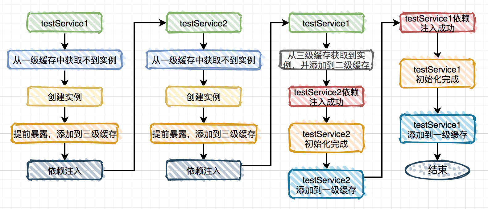
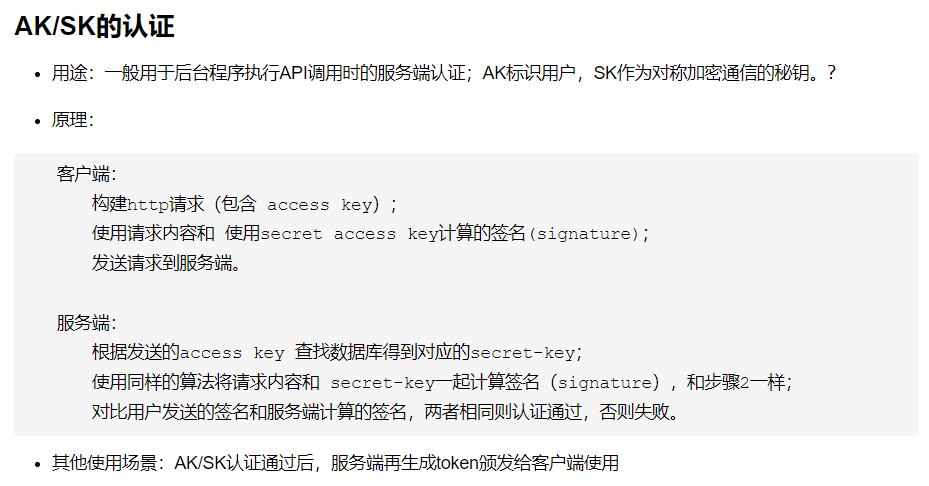

[TOC]


![covid vaccine near me](data:image/png;base64,iVBORw0KGgoAAAANSUhEUgAAAfQAAADICAMAAAApx+PaAAAC7lBMVEVHcEzwOUP3PWj9NWXoNjHTNij/Mmb/M2aen53W18XN2dDtmwnR0dHNzMvNzczKysrT0M/Oz9HJycm3wLarrKr+yAH7xQX+ygDn5eKampuOjpLU19P/zQL+yAD/zAD/////ywD/zADNzs5/f4KZBASYAAD/ywD/zAD+yQKYAACZAAD7wwFxb3DrPTGYAACYAAD7wQb7+5/aycEKzc2LAADMZQv//53+/p1iYmJE09MBzMw0kOg7fvE5e+5DnuitKBr//6L//5n9/pz//5shbVwAzMw/gPFBhfRAhPNAgvNChfQ/hPM8fvA/gvDorV///7L//5kwpkw0qFIwpFA2plYKWi8tLy9JS0sDzMw9gvFFifj//57//5gYaTgYTzUyNDQfHx+9lKmmxuEDyMjFiVvcwHgQHn4BZzMAZjMGWi/9+o28WzQAWimPzOEBzMzv3YcASh27yYL//5wAy8q+gVnOm2f80Cv/uQA6fvTWqXLGk2H84VXo76EBzc39zJjyuoB0tF0lozr/16OYAAAZdUkWkj4CoJ4Ct7QA1NTX6Ydxvrdet5xJqn07sVc7HR0AzMx6sP+QxP+r2P+g0/+ZzP8AZDFLkPjrPS91uNqd0P/qQTHrQzVPbD2k1v+Vyv+UnJrqQDHrQDL5VELhKSSIvP+f0f/mT0N0qf9tov+p1f7yRznmkkkBA5oAAJcAAZkAAJaAtP+cz/+dz/xUlv0qcfYAAJkAAZjyNiMwd/MAAJcCBZmZz/+az/+dzv1hnvmZzv6XzP6azv+ke2cBApmbzf656/7MZADMZQDMZAB6s/ixzuP6uwT7uwTvqQPLZQXXfAfGUwDMZgCcyviz1Oz+wgXhwEmbmZz4rgD6uwdeoN9aWZk6M5D5KhHSbXLdW1jFgpCpr9KO4f+C8//VjjYvVs+0n7uL0P8SJrGdnJ4pTcp/f5GYkpTuvSSYlpY0rL7Ly8vNZgDXzMPMZQBArv8AkP8hpf/A0eaOoJO0tLSZmZk4AvjoAAAA+nRSTlMAVo+pPSXW/wc9GRSo5v/8yl2f//4najz////+yVT//6zngf9jsdv2lTz/vP9w1fF+JvWZ/4xMaf//tixPQBT////agCL/ha/b7//GmWX//5rY/6luYM3//3L/xu0+h/////99//8Qv/+h/////9T///6yQ//////////8/+3///3//4///////////////2L//////9//lf//0f////+3uOf+/v+L////5///mMm2fP9mL//m//D//945eKO5/1Dg//9dzf/O9ujdk+3/pVX////8rP//Xv/T//7////////////////+1MLQnP87/7W3wz7////a/3b6GztmhQAAI91JREFUeAHsxkUBwDAQALBbuf4Fj0QMk1cCAAAAAAAAAAAAAAAAAAAAAAAAAAAAAAAAAAAAAAAAAAAAAAC425JyTiUO5egSH0dt/ZQjRu6nVuP1GHNjv64WGoahAAwfvEIFkm5Nup4A8w139/d/Jk6Cu05S9k2v+0eJB2/xZwxT3TQ3fBixmzsbhFEUhvEcvDY98+DpX7DZiDMfRYxrLIw9eGFs5m1jMDJwSan8w+ZxmnIihJAiylx4bmLmbRMwvMqVSg7/QBkRc/iJmKWKCS5Mdcky793VnVixvidIEii+BURchB9YCkWquDCkrFZZbH30HJ8+jFq9XoNiqiBiA77Py5i8iy61qgznbF/e/SaSFhjtDqlDITUQsfuTiR4JmSmu53jVfC3zGJ5asfAgl6OWg7ba0dpQQGZwt360owsZKb4swowvV8myzBx4wpm2bXUnLSRNH8hapwhTPV/P3zm7rMO3eSEXVYpeVURXX15ejjx4anLmLVPDv/BhBUi9Yzh2N3+zbo6kBN+2EQpZZUowRdJlY3MLnhm38JaeoJYAwFRH297Z3dvdsHrzxuSvbileRtG5EtxE36fk+/ubB4fwzPRwneIc5+hYOzk9hXeVkPgPU3377Pz84uLyytLuLXzzcrbeXCyBcX0N35CJ6jJXfD+l6HJfN1/ePLhh1iy800jCAD68l9zbq7u7N+6GZMkFW0i3UcI2xA7SjV2MCFwbq3sb97rr+b93szvAwGRgUyW/uOeb3/tkZjCEW49fPQ1dpzGazBbOj8VqK1EzEdbp5AnUBrOzZOtneL3E2WDvYtYCktW/HyFYywBEaVl5xUq9V1Zt3Xg0affBrXlHt26FzvPy8uxH91YbCOuq1dHQ1Q4rJ0C4MMw2LX2hUP86xxdmoVTXy9TkoPPLQ4dPpoHViU5dYjSFVTFmZ3A/gnA6w4tfmURphRMoUVxbVVd/dBeSDoHOIfaGRgPk1yhtPQ7EAo2J4wSOgsCZHbpIM0uNnnehVHfzyDqbDk7BHokWcbWhg7rNclBassCjfiXTdF4UK0EIzjI/peVRvTub6yD1dbu22XfD8i4Vdgl70q58g4Q6onVVTJRbuWhYjFTtTA2U3JIgp3orzyLpNfuQcnLyjVX5slnNFrMNNipJOudHKKHNcoeATK0oim3Fa/Auq6IME7Wy10nAVD+Yt+fgNnsewm7PaDfI/EaO8LF0rrVSkxwjCBYHWM45PYRvhdKzsgo7OlhWkt4ScH4i5l2dKbH6i5WESQOAmfNjpI3qiX53baLY2cXXFHXnIvHl2Hk5iEZTLbK+de/ugHR7nT0DdnRED3nbFjPnjC26coRgVQOCXL0E35GVlVDo6XW53HKms3390tFNYlrMnTuQYoyJMQbfpexHTu5EYRW1tYmdZaw8okiTKVOGqVBYS2eVJL0ebteO1tkhdXVJGbsCzqsLAGk9Rs61ZjS7KSEMkMkOiztK9UKX19vr6/W4Uar/vu/U/pgbp5UvwWwKzqeAZOeOtWg01bNlnWKbeIENTKbOMozyDF8rWz+6ce826ShuT8OuduRc4iIDyAofE+cOpTTHCDYQSg5yznZ4IYNDvT6fq0O2zueClRC/9jNv8U/s+Jy4hKihWHSAys8wAL6rE9b3YV6PyKkYKQtQCpRByV63Z+PeDRsa89vzDVg6HOVI6z/FwLlNoIzrEbEyANONnLe4XL2Do6OjQ75elxtlRxFQ5lhKQuqlz91L71x5XJwCWvp2BIUkwvp+mUXOW1qGr4yMKLV0SrLXS9X96jXDdQOmB5AwMXDOkVisRodWDSlxmMxRrdf4E93l844OQrw+JB2ifDJ3KUHi2Gck+mddf5g4JTSRtiMQvgymetsNFMzevTdv3b5ThrxXgBVRXFWHvN8NWL8uq6++B2KPiUhri02jI85rSOthSQFh3VD6IGR0CEvPUXYuk/KdLjqNyq3KCCh0+2PC9b1l7/0HY2PjE+03b0veYUt3Tk42A0Uq6xDIOny6hjP9B7HjBDo0JbBNha0D9RBGHVYMhCkb7n6BTO/1DY3CAu/1+TqQdBZKj1clT0skq+Lpzj/3SvYw3khTYHaewC1fQ2w3zRCOwET5Hel6BKu/3AYrvJ5n9S0XGttnJmZnx8fG22/JLX1SREc3NNbGxyUnx8VJETc1Y+vXr1+7evU6GuRi/ag2I3YuYWQAFV24diOWjuh1+XoHB4e8Xn+iszyfljw3j5mbjqM7/6wHX+xDt7kRWHsAt3xdWP2SihcqWmG7FDM90RH8cGebuOB1t0gBDV+ZWFycnZgYH1t6CCu3CKGmenzyo8fBiFUAOLH1qzDdJQrAj4N+M6wJSweTOmISAS3OE3yCGUyLDg+07vZ6WuGpnLRg7NCTp/MEc8kAcywBkXrssx+muKKWb+UwoWGVWEKsU8b3NfoA7A1xwXPG5+mVrI/cHnt2/8H47NLs2NhzUCnSM131aD6MxzDi5jrE1auwp19Hw/sPYydNui5sD24E0WBMQshwr8NLhKz3+lythQnwjKaFZfmhF0+Rc0K7Cvg5nYBIWfvZ958n10bNdNTytQIX4bS12MphlgvIwdI7fEPSkOJxs+yNKzfHnr18+erZ2K2b469BswgpBgRxc/MEb948VvmT/a79moTBkAl+DOSKYKwCR10cerIbcYo4GCBTFFwi/YWOLPkA3sWzb5FyCtMMqoIB503gs0hDBVy55ZujhGUWQr/27v2Hj00gyC/Yuad3EI4pXo8XDnVX2hfHFpc+PVssK/3jT9AGnZ8HBMnzBEj7I3+y370MC/zV6ovgh0IOQeSwUwIUMQr+FqkDfs7qg7B8K7pgHUWVncqbuXgASfHX9rVf0qO2K7d8LRfgLyMg0f0dlO4AH/6B/PsRLAuIdSPpQx4vyw6XzT749AB6b5d26U4RUgvCefRmns7cWuCsQtavXS/QgR8JZQhiLJ/lHGKSxj6zJvTwCsO7ZekJ8//NR+ExtH7882c43NTTorf8E2FbdMEKlqP+n7nzcGrjyuO4nIOZDbp+h53ee6+k+4TxhJg4uKRjX4GAL1GKy1hBECbE6T3aYuGF7A7EAuQuIxOtKYI1OL3YcrdFETFKz99wv/e0+/Skt4iM5gblm0pxefro139vrWma240T0hXdCe3uSc/jwNJR76GxvM7pQCGdB+8eEN5c94At4d3/mca8ZUp9YLdx/0pQfyz3dzXuZvJxVmw8WJiS4M+jTN0BuxTAPLM2d9jNgJ7NBYnCwulDPvVu9pKozXXt7G3v60fqC3SGgxVuzV2xsKfb0Ifz012X0wXUG6vff8FRjEK6okiBgPDWuvk2DjFfb0tRM2XnjJqNvuy7/8rNEpidNXTWIDJofqmRt1uaevVNwPwDK9L0/7ddCx4B9NL/OWmxk5B/V9q5Cgba+wclSdIlJF0XBEFUA+Ey7R5ut0l9dzp0h7POtef9x1c93nAahHQ5wIuCor+9BHourHdv6sj4Pm8y+rLgHWZYs9OhP8ok49mIiupowLoxhXlz09V50Ktoak5xdxtvyn5PvqDoFlBRAfuePv/8OUYvwsg9QBUQibp6+yUCnEgXBUHt9NpWEOpDZFRMclPHC6gV61H4p3XJ4+/0yDikr2dy91kpjFuhFwVtKfrMeYkhzIMzPzK/8pxLz7bMYt3eR23ZaxlF/R9X0MxbZyXLGTrP+QCt1F27Iotf6xbyi60pIkuLSIV4VYcDbzbbTD1A7l1zdw5LU0gFg/f12mxDBvbtpPNAtOiNp6Ar9/ZeURBkRfJ5FAjpkMal5+5cSn2Sb1HCNRv7FbnYVLenzJrdJnTvrmx/wrML6dwHUrmNFNurUydqdB0DoX+6JM5eePZ1oNnwS5gqmkcTWTb7o48/udn45vONJXwI+aRgc2tln26SJQvpsgz/UlE6/hkw20b795Rfw4GnLi+8/dYGSYCorry5FAydSeOaqDQ1z/oLub7EwA7XvPdl2e+5FEVQusxpDKW5NEp5bbSDzxzQC6+78vMvTF3y5Vd2KpCQkPv1vv37939lhi7QWabh45pMc4clQWdwi6Ii6jyvS7JaERYVtc9m60mkcly6fzem6k+9AmOWd956M6IIgn7ggVXpaVw+OVcHlGfWsb45Z5ivh3hYAvEwvTm9IEvm5F5T0TIjCLZsZJkT5VPZTsaAfvaVX6To4MHPL8vHDoXmcQgx3/8xRjXHWGnkhrZuPXzLLage0yp8gpiKWxFFifcFPKj4knVZr9C8ksL32lYkoNPTYiI0dXnlnaWAfd3St998Wtj79qqpDb2N6Ts0Uy9HDlRQYjqu5Sge0o2ZhVlPcMgeYdHiecChcaO1b2fync1XZ3gv0cgN6l8cPHK0eFEq9JUAHWQ3RohnnW2G59XFx7QyLSwKBm2MW07gBnkCPl4F9y5LXrd2zybhgG0Hhr6NacSCFqFUbilARwJ7f+D+DBG9gyWbR0J9LpiXLE+Jh6dSRbr7jqxLQLonev2p1zcDdMadMR2MzO7uy4NfWAiof/HcIgfpCBQ7DEv/hEtmece7sU44gGZYUCQkUZHVVNyiKMqyLiH37i7bdedfwLtjbWU6sSAHSuUM5qB3nliVIXVvZZ0bhh4KRaPRmUfOGb6RyHlLqTtBHN7t4Aa6BhLq6irgfnUJyPTBMzl3EJffQpQ/hfs4yjAnOvKsYxHZyKspTxj6zcmZ6IluQ8VhLawoIrbyQKeJG/gDbmT3IBN6xVzbUHdCPVZVqANSOfDuRI+z87VWyzOhQrW1GeMOtXSMjFS2zzjzecWMwAVC4NPKguFP+wdVEvkkaXCwv693oGvu9KZ+/lmpzGdNa8jNmdw/aA5J36ypY1uHrnh19dpqzHzfLaRyPMNkfrz4mFsRdL8qw3ECgFvHuGk37/fJkqiWucuCC1HznXj3sy/B1xVL6FSOgv7OKxajlrZUQ7fnzwLcbZh2qGN0ZKxyvEqPTUzEumYY+jIGubMB2bg76EF9JomVLkWG+3q7Mlu98VU2oyERjJtriEufRDVZMmdBs9TR+KveBevWiPk380w7bzCZn2hwbvAISljzoYNhXy4j3LSbD0D2LvII+sluytDJPIcuDl+moL8M0NdP5b2aAHdra4th3KNjlZPjkTjgBuB6ZHx4hqCz7gqCoaGGMq3MzysCOLoMGuzvnfb3ykIPRfOh0w2N7uHBiKHBYew+8qNRYhas7KydHzzIUHfUwb4GTL9c1fv37XcuOtUotExD/7vD4TyTFzo1COsSSEa4gTaJ6pKM3Xsa9B1pj1S5ZRkx9VeSIR32p9bPnyI7DTHGDbRjUtVk5djIaEdoZjM57nqCvHjlymKHYelaWBUUXRJlVcqswb6BTK6eiW7RUMcY7nSzig2PjYaioakCwNEUwJ+fNxt03ZWp1J9bVAwTbjzzdH2zDz4qMZY5jptmvnJlgyLybijbVBGY8x4S1Sk3LxvQvVqSOYcvK59vJwVuCeiW6x9YR4d0YM5ApyI3ZdxV45h2wvLhzLlx7ni7xbXSgaH/zS8oqq4IKji6aRXpG7D9CrVh5CPjekyH+GAlPRYbH2uJWkO/jrbqK8/mSKPmcwr6EeeilWsb0bo1rDeUw1kWG74skcadDhv41XVxMaxBwtIpIOiAW0W4ZcBtunmPT05AryjDzbghbB2I+aXMFO/+pVRIf4LppF4dNY1bAtqgWGR8sjJJO4TGTW1trTNp6fQeG9xIcMHKFzZ0EaxAUXzhsoBi8JjG3tun9fNcG5xzZDwGyKeSjrBXjYBZtLHOnbbo2Slf+fII5eBXfpOw9OcT9yrWYEM3Lf14eb0LPv+0hkcKspxw73pqVAcZ0GG6+i2sUKwg9cglDHNuSRL6f9mJScF3leMRPQaKo8idcOUhgzaorbmp6as8+0zB3rF799YVVCoKSS9cOqpfC6buLJZ9kiz4gm4NpTtY6FXJCF7vH1gxjaVHWyZjE7rR3UbSyV8J6djaJyZDUdbSz6OYp29EPZekfg50X+sRdXBbdQZ0aJ0aMX1POdysqt/iDOPaJCBIIIzb56PcvOHeoVHLx78fSp6qcA7HDpOXJqHPtzHqi4FkcCi+2CRx5Vhg3Fd/lc/ZZlI7sN/avnXHD2cYgpS3scZVvuf4iRMn9wLjsKaBOSQsXVahNelT0eszNXn509K778wQ35tHI+DcIggsP4V0HNonqlj3XphEfukcJkIR6tClgfzNVQcL9q61KxF0I1NtwCG9vBH2sOtd9bjHjFM5XfIxUT1xGr4TEtm90wwYOfpeOkuwnedF3s/Lij8YQw5sM6KNcM8C3NyMX1j6sDtdexrhttnz5Tj4+fYCczfygR6Abrw0fr+/E4qZKcnrguCBxYPSR++yJn+KPBEb64jEUU/EYyXkVfXIaCVQZ6Bfl8zYz2aX0Rc9m6QOpv51PXgt2FgELTazlguxob8IqnN1d3thuopTOVn1UFE97TiC5C+1ZVbGe+ldUtAjeIK8qIc7AXpbW1PTrDw7Qzq30CH/QdBBJ4OAHKR5BAkLD58CGLzHp8rW4GVBD0McRJfd2McPFQzG4ODR8ZiEpacJfQKZeVU0OhaL9dvS9Dnx319aNJEXFVMN2X1Qn4M51+BK5BYyDj0Bhg5HhLz+qu7ub4PkcCxuJFkRZB9anpnG0pdkupfe7wvyit8P4SMYiP0IoTvH2spAxxePMHQkN5gCtnQhdRClEpOXrExeFAJQ4WOlO8be2MRItAWI4sUUSyHok5DnTE7ECqbqyxy0W10eXkQcPEDftwUmq0bxeb0JHahfVf48OSJ6V2tB0dpliYi43wuJHLM0xIZ0Imbbaa4SCKoGdI/Sa8u9tqcxP5GA7jKga8gUjLoGSdYJeEWGoiZh8hCtgHyqU9S9miX0ruGxKNRsI7hg8wV8jAI+sPUYfFOoZbKPm8q7X2mz0HIHmLqpr2tQY84YHSWLUoezvh5FsMY9iQN6ITsPKOxAXUELcpg4e1+ZUcaQ3mVAl2UZyEc4W+41tHV3CnUXuljaWG18dDINOq8DXp0yeeCGTT49v1MVSAesL/oCcwAaiUm6GgB5yN/mB+DhY6PwXaGNzHCNIGUjOqjICVGdatAQFdG35CFzr4Ol5W6sY6IP1+MgMmFVBEXmA/4gLFItILvf2Yf0ApkP+gQALyL6YrvtN6H5PUM7frjwONaFLkh44R/4wyX+/vfVb4xrCej+RPYudabj1cHIZZXO7+TE51VRwNTvsO7DhiaRfxetJEt6PNISsujCcmY3rrYWDGigF/dwExoe7mvvHZgH/r2Whb4sZRjqqobzVbuOI52hqKq4V0E9VwUkKHiBojOM7B9sfG4pubOZfUjnBuWwX5DAtctSsFORunKMm72d5YDGDKS8NaQPm4AeVvQESqv0XZfp/I6XE5+TZER9AevN0PCBBHWZEXIksfGQ1ejVbiL/qaZvWGLF88ofD/1UW2s04An061MfglINfQhcyIHOrKqKdPIgYA0HCAcBt9u45eC9y0agl2Yb0kH9YOG84MGm7vWJg9xvBTpnQoftfWhRFpuCaTLIbUCXZOv0ncrv/D7R+BDOGNTutRydGkEddT/T5fGoshSrRDGgja3SMfJDf4vEVV1ipat8PB752yHADtDJ3KjIDPnUo29WkkeGOBs2aObSAKLtpp878iiBnm1IBw3Icjgsi+GgJEKlLsnDad8zqzkvR9RLkvOWmpXk9XJu0Cj3TuHNYPISSOS9PkFVJMslqzxoR4VQpQ6poIVUI48LzWKhY+TxuCpNJVVS4/G//VQL0NOZk21GOB05IOZ+964ywproHpS73Uc+4rIN6aBh5NwF1J6RdZ+k64OHaffVBM3Y/NxYOkc2pRzUK+L8Ywp0ncargMnT6Ttte4JHK9MVVQgYWS+z/hmNTsas3LuI3Lse74C+1e9sLPTanwA5XeBL5C9DCHxcrak1oc87lbldla5lFg+SWwBBnL7jmLFmyxjSQXMHIzwvCpSGD/S1t/f27tz5l1NGRkFtP3NcrqI6I+eae7VkTNdV1rBVkr7jit1s0UOtE1RkXbbKWgqGYeYwAtCnkh5B86hB9oLKwUMRg7mkWksCIWNffeQggr68hGOmSozs+JGRpShTNx5Bce+jBuP5ZRXkyQTZhnTQY6++9gvRhg3HNmD5nuZ5NR6DHFIQhE2bNnXlxMGzzB0HPvVqmhnTZdUilv+PtjOIieIK4/g7dJOBjW11q15Ko4ZGqCmCgCZA1qQtykGTJr0g7WkJx5KgTdcLV/EGCxuIbXaS4gLRNHFdLliAZVKqhhCVxU292Ghjxssm0qr22u9737zZt4+vsM26P8z6MW5iZv7zve+9N+/9xxuxo/KQ8nR0NEUPLW1nkRPdwcUD9E0W/PenjqNfBOteK5BzQc6cjbfff0/h2pFcBL72PSzoPVFtOlcyHPfdzM+dkXS0C4JEJ8IllnRe9M4h4NIl/IC/4A994OeQfz/0ChMLUBGgR+UT3LefVf2ba7AsfERmLfXe+ak4GrFj/25GHnESODND6xPYVJ/fgMfphOs47hX181QRf7I4rwvWencdsV0bemlZG7M5ZrM4cTcUXQu5sdUmS2hYNTW86kpzlg6+ppde0ol+NBUZAmsRBJyEAM8OtHuogGkolX5/F7LHEk1+VP1CRi+qy9/JdJA2dB+nuu5zvmkZZ9LHkuNLY5q8V9haLpea2JToyYvejL2dyAiWicnHj3F9WCSSjRfqcTby5AkuHHo8XTxE36T1jR/86eaia9EQtvBykbL5I+9CdyAajUbcZTyxukZBBMG8uY45xc+axHaojlzP6TJKugiTE+SQlBlFJ8Uvo+iXC5iiv3iXSIs9XlQldnvRobegOSCL3pf69TghxLxM3NGEHSe4qTg95ak98Cbj5sYTvyUtwTOhnipP/+EzPa1WFU0IndZ14rtv+6LQge9z5YwBB5YXeWPkIwu00+KIrzntxq3WThFKfqm7uk6XU9Iv+CL72hOoercKOs3mveqY1PcvS1TtoqhaVL8vo13l1n/a13dYSJo+/1rmAphZS7nSCzjh7ugT60wt9/p3cSJBiQ69oufPyLODofbk9Uk5NWeAm9iun6wXGn+vezy4j2ulojlbLnAaSW0BJlQdO57HO+OR2mmBhcv6ULPmbzpxXp3ijo2kPw17qpyS3tapQ007Q7MwwSWjq0WRJTYgWnyLb8wjrCZAK8BTONPKd7jMuRo6jDNxyOwcrRrmCMCW1KuTnDPD9cmrn7Qc1a/e7XVf9d9B9ehaBFOdad3hDyR6RE7JNaozO0C72IB97CkSVgdf0hUd5ZT04bbBzhLoFwbz2G+Rq6JvZlWUWYZoOVN2606am9T49bBjKeWMku688mr2PYWtPO0PQGaf0+ZejgZp9/8jp/rJlpYiA4oACX63tXXzwf2PMNWpqCfGDGhmyA2h5g/36m/UCvJ2sfvrGi2KOrrM13YY9lPhMko6EL7Qu7Pwg8Z/MiV7O9gXnvejDEYQlq16DffCa8ySOr+yjcNuD113PuWTjkz0GS/Rn2nmDQZkKNPysWGkhxYFDWQ7EjQq+h08EGxdw1QfcEHz5EhqK9h5x7r/8EhhU1Ud7wZO+X/Ed7rsCfMVvfySrrgw3MwLzzs/V8dHJWMLlhclFsVygkLbqpTjkO9D0gWPlUF3Z5Tf9uBv4qdiPy4TvWf2l1tk3sAnOhJAZ9iJH35SS0I/hQO1phnspr4dre5hFIo6ih5LJbf+2A7146KY6GqRelDwUMlHf0gydm/nvNGIjtJK+o4mEoPUb+MxnJ8ziZGXSGwxraKV8LWkjFKJtKgAjZQkRBguC+q+lLLHtkl4fbyG9ms3KNXNS7FV2EDgnUDAKr4h6otL+j1/r4MckOGYjcGJ29ko0Kifxd7tOjN17cocsqf4oXn4NG8Py5f00oz9m7uJ5jZW+95i0ZOvJK8X0zEvWqm+9oqw0xV77dxhEkLNQeMyktmZpIOrDJw4jwOP1pT19xfGTk+FdZR05ROjvtjs26J5mQD9En4TCfXlZFHncSO5gVBkwSqMTA5s65SYn7uo2Wf5Gd1+iuxhlRNRWSWdqnpYhJXmsshvaerxuEYmpUSvSvqiZ18RsXTlzMUahaY66Y4JT8KzTX0iCd/Arc1YIm9tLer19b63M28u4rsG1tKXA3c0WwGRcW3X5SVXuIBf8oKN+3bYR/3PXPEbBc+dPXvuDL5skLGuZ0t6SaL3QsPe29ZNWDSQM5t6w/o5HH/5GklNiSxFIwtiZURGL5craBN70NJVN4SPXUHljZyHATSQmrlZWIF3Q5O8ARp1r3E/KniUJ2xDbQN8WEHVjyMyU5GsK7ER7ZGqbXvHsys7b7QplPyDXSrVWaiLV25JH+7WoFbcavbSvrlfZXo/HK3a7bPxhjjkR6u7V71oo0qIinbliHb96SOtJgLlUzHIeSm9p70NvXywWBqVz4x+JtHNdp2o3eFtDqo5uL+OWNqiqVzfQCiEE7igsy3BR+zZbCQUGujL5ev+X2umHJ9ZaAFN2SW9X9N8UCU//RqGSzvsCS8smnAjjnlokRYeqoy32OHisW3YvDgXPeXx6Vp8DLUH8QGSP8OITuVa1WwT9t5ood77pt4GPYoCa2v5fD5XIJ+HwRx14kpFlfyuUt/hsn1J/2rbXrvPcFH2d9KvUvhuC6fWDd7jQkRURvXGGnMMQ4XOVB6ln10it5Z4nFRfsPzm/Vej4eZ9fpnePRWB4G3QPCg0LFwVK4WP/sveGUC2EYVx/IPwmlmmXWwuYRhjhRlVyNaAW9t1K2qChgPl0kKhEAAUoApyAAWAJGWRWQ7g6MYm7ai2AAjpFrEIaIG99+76Xp5eXq65eGlrv1bl6qi73/vfe++dfk8Et4TgW3jyLh/Jsj4HMvSdnZ0As/QUd74JHlv8Ye+RBipdCjevbts6a8mXvOs+v5S1LGv+MwZAGMgJY7TB9T9fCZ1At3ttCNavAsnZUxAIu3/PwhuQYRS2cTUCz7suGbvz5/sW6y/d41Sa/wmE/saS9EtCMkbPmARlrPL6wH3kL/Jo6FWK7tddR0DG9KB9PB689FP+48nwzfn6+K1SWVwGGQiX98Z1pda3V7D3nRXpqWue9lTPC1ePd5u7wJg41+Lx8wkJF/gE7SIKCknPv7cq2X7Sxe11HV5ZkxF5Eai4s3dWBPqASBmCZ89w4ZFjt4Qc/nz2BMHwLH+wKuzCsviz1VhF4Ecmt6G7MV+nFHR9HQf+E0hBu0T7Ztp3dLcFjFYikfgDEvQEpq18a/EGuSV+zhfF21T2XYadDrKjIsLWX0yDFNQ5PP15jCFlA08P6xCSYuNrtkLFZ7P5RqPZ5wWhQTx7+2h79b0zJPAGDGJrjcsVpaeAsadp2jlIaGuYE1BNrdloLFmWVbGs7BK9R97+fCBgfmFd+hB7p0YiMIgOrhJ3+Ov10wP88+ioCyEhJX+bzd+rq8tzZaFSoAiVndGvYk5cZ4Tyv0FJCdIDJz2qPOlcZnP+YyOfJ+JxwhcX5ucQgIgjLr2PHjyZOyKyD45IjcCw0k0+AuE1Qf2TztlAcCVdBzmyFZs1ZnQyHn8cjz+XMEVOmJpUL50AQJPRfDunc9/yp/vopWPq9JVMeOlOT5lnW9Zec0x5wWDhH0I62rwW9OjDWJIgm7IlKbGpsUg3wb1LA/753bkr0os9bRS5l2iDHzqLuQk90k24MWspzMwMH7w/jwVnrNJN6XkluCvSS3z5kB/4suHGPCP8omBCeCZjQXl0S6WDWSzvw12RbgrvgfdlXZPpxVyUDqNgigrF331x1+SSDyfGL109YaVLunR+BP4YObFYXG5k0iFKp2xRCSca5gIB57/08F26mHs5XHoORkNLS2jSKVs7oY1hygaSgdwYpUdG1qXzQ0e99Fu5OGM7jijdcWwYAw/q9QNB+mx96Kwj27ZZtIXg27YOgymQPv6eSucjHC6dUgTl1L9R01w6oYNgGOwa21fTFLp4SjmY9JxhqJN+qVS6UxWlezjKc+5p5tIpsyHG7aJgvRq8SZvszcv9THrRX3oZ1ILq/tK/h2zI+8Bg6ZePWsTVmvuZ9P0qA4Fws9TS5dK7PdIPQkq3/coq1mAAqOBJz93PpJs17pm3gJo5ppE7psNbwJDTNlSqepSAY9+g7zIKfCk+JIhMw1sgIX2Jk94GlZjFMsUBjFOmFE1Qz2yHMktz33HpDntNNUoRQQ9OqUYoOUFU6YaRyegwAlDrvIVARntv7wT+tQeHBAAAAACC/r/2hQl4AQAAAAAAAAAAAAAAAAAEe6UyN7dVLbwAAAAASUVORK5CYII=)


# Java基础

- [Java 中 Comparable 和 Comparator 比较](https://www.cnblogs.com/skywang12345/p/3324788.html)


## 反射

- [利用注解 + 反射消除重复代码](https://www.llchen60.com/%E5%88%A9%E7%94%A8%E6%B3%A8%E8%A7%A3-%E5%8F%8D%E5%B0%84%E6%B6%88%E9%99%A4%E9%87%8D%E5%A4%8D%E4%BB%A3%E7%A0%81/)


- [终极CRUD-3-用Jackson解析json - 一杯热咖啡AAA - 博客园](https://www.cnblogs.com/AdaiCoffee/p/10933091.html)


# 集合框架

- [【Java面试题】List如何一边遍历，一边删除？](https://www.cnblogs.com/zwwhnly/p/12530819.html)


## List


## Map


### HashMap

- [HashMap源码深度解析](https://www.wolai.com/sf5JBE9KniHcyFXU7cU3qJ)[download]


## Queue


# 并发技术

- 参考博客
  - [死磕 Java 并发专栏](https://www.cmsblogs.com/category/1391296887813967872)
  - [#菜鸟飞呀飞# - 并发源码分析专栏](https://mp.weixin.qq.com/mp/appmsgalbum?action=getalbum&__biz=MzI4Mjg2NjUzNw==&scene=1&album_id=1342562813512089601&count=3#wechat_redirect)
  - [【原】编程界的小学生 - 多线程精品系列](https://blog.csdn.net/ctwctw/category_11037393.html)
  - [码农参上 - 并发专题](http://mp.weixin.qq.com/mp/homepage?__biz=MzIwMTgzOTQ0Ng==&hid=1&sn=61767373108708623baf6840e68586fc&scene=18#wechat_redirect)
  - [【并发编程78讲】由点及面，搭建你的 Java 并发知识网](https://learn.lianglianglee.com/%E4%B8%93%E6%A0%8F/Java%20%E5%B9%B6%E5%8F%91%E7%BC%96%E7%A8%8B%2078%20%E8%AE%B2-%E5%AE%8C/00%20%E7%94%B1%E7%82%B9%E5%8F%8A%E9%9D%A2%EF%BC%8C%E6%90%AD%E5%BB%BA%E4%BD%A0%E7%9A%84%20Java%20%E5%B9%B6%E5%8F%91%E7%9F%A5%E8%AF%86%E7%BD%91.md)


## 多线程

### 线程池

#### 线程池创建

- [springboot集成多线程功能](https://blog.csdn.net/qq_38542085/article/details/99415881)
- `JavaQ`：[我画了25张图展示线程池工作原理和实现原理，原创干货，建议先收藏再阅读](https://mp.weixin.qq.com/s/1oEdi_J79lWaX0649N6BPg)

- [如何设置线程池参数？美团给出了一个让面试官虎躯一震的回答。](https://mp.weixin.qq.com/s?__biz=Mzg3NjU3NTkwMQ==&mid=2247505103&idx=1&sn=a041dbec689cec4f1bbc99220baa7219&source=41#wechat_redirect)
- [ThreadPoolExecutor的核心参数以及线程池状态到底是咋玩的](https://mp.weixin.qq.com/s/zUfMpZp4Zy3jx8oeQzt4PQ)
- [@Async注解解析](https://mp.weixin.qq.com/s/SdxnKw94H6V_UBD9oe6DGQ)

> 美团技术团队

- [Java线程池实现原理及其在美团业务中的实践](https://tech.meituan.com/2020/04/02/java-pooling-pratice-in-meituan.html)


- [Java CompletableFuture 详解](https://colobu.com/2016/02/29/Java-CompletableFuture/)
- [CompletableFuture 使用详解](https://www.jianshu.com/p/6bac52527ca4)
- [[译]20个使用 Java CompletableFuture的例子](https://colobu.com/2018/03/12/20-Examples-of-Using-Java%E2%80%99s-CompletableFuture/)
- [Java并发编程系列一：Future和CompletableFuture解析与使用](https://www.cnblogs.com/happyliu/p/9462703.html)
- ***[CompletableFuture使用大全，简单易懂](https://juejin.cn/post/6844904195162636295#heading-1)（分类、消化学习）

> 分类记忆规则：
>
> 以Async结尾的方法，都是异步方法，对应的没有Async则是同步方法，一般都是一个异步方法对应一个同步方法。
>
> 以Async后缀结尾的方法，都有两个重载的方法，一个是使用内置的forkjoin线程池，一种是使用自定义线程池
>
> 以run开头的方法，其入口参数一定是无参的，并且没有返回值，类似于执行Runnable方法。
>
> 以supply开头的方法，入口也是没有参数的，但是有返回值
>
> 以Accept开头或者结尾的方法，入口参数是有参数，但是没有返回值
>
> 以Apply开头或者结尾的方法，入口有参数，有返回值
>
> 带有either后缀的方法，表示谁先完成就消费谁
>
>
> 作者：愤怒的酸菜鱼
> 链接：https://juejin.cn/post/6844904195162636295
> 来源：稀土掘金
> 著作权归作者所有。商业转载请联系作者获得授权，非商业转载请注明出处。


#### 线程池通讯

> [why技术](https://www.whywhy.vip/)

- [面试官一个线程池问题把我问懵逼了。 - 歪歪的技术分享](https://www.whywhy.vip/archives/91)


#### **线程池监控**

- [基于Actuator的可修改配置的线程池监控](https://juejin.cn/post/6902051279154249735)
- [Springboot异步任务执行及监控](https://shirukai.github.io/blog/springboot-asynchronous-task-execution-and-monitoring.html)
- [Java踩坑记系列之线程池](https://javakk.com/188.html)

> [why技术](https://www.whywhy.vip/)

- [如何设置线程池参数？美团给出了一个让面试官虎躯一震的回答](https://mp.weixin.qq.com/s/YbyC3qQfUm4B_QQ03GFiNw)
- [填个坑！再谈线程池动态调整那点事。](https://mp.weixin.qq.com/s/FJQ5MhB1kMp8lP1NA6q4Vg)


#### 线程池执行

- [70%人答不全！线程池中的一个线程异常了会被怎么处理?](https://zhuanlan.zhihu.com/p/136571068)


**任务取消**

- [多线程中如何取消任务的执行？](https://www.cnblogs.com/rouqinglangzi/p/10819377.html)


#### 线程池销毁

- [线程池中多余的线程是如何回收的](https://jishuin.proginn.com/p/763bfbd3232d)

- [非核心线程在什么时候被回收](https://mp.weixin.qq.com/s/1-h5AHhJYin9c9G_ozdJqQ)


- [跳表（SkipList）及ConcurrentSkipListMap源码解析](https://blog.csdn.net/sunxianghuang/article/details/52221913)
- [Java多线程（四）之ConcurrentSkipListMap深入分析](https://blog.csdn.net/guangcigeyun/article/details/8278349)

- [18 Fork/Join框架](https://redspider.gitbook.io/concurrent/di-san-pian-jdk-gong-ju-pian/18)
- [Java多线程并发最佳实践](https://www.jdon.com/concurrent/java-multithreading-best-pratices.html)
- [并发编程](https://www.jdon.com/concurrency.html)
- *==>*[Java并发编程：线程池的使用](https://www.cnblogs.com/dolphin0520/p/3932921.html)

- [深入分析java线程池](https://luyu05.github.io/2018/07/09/ThreadPool/)


### 多线程实战

- [【Java并发编程系列8】多线程实战](https://juejin.cn/post/6965364393664053284)


### 八哥记录

- [在同一个类中，一个方法调用另外一个有注解（比如@Async，@Transational）的方法，注解失效的原因和解决方法](https://blog.csdn.net/clementad/article/details/47339519)
- 


## Java锁事

> **StampedLocks vs ReadWriteLocks and Synchronized**

- [Java 8 StampedLocks vs. ReadWriteLocks and Synchronized](https://www.overops.com/blog/java-8-stampedlocks-vs-readwritelocks-and-synchronized/)

> [美团技术团队](https://tech.meituan.com/)

- [不可不说的Java“锁”事](https://tech.meituan.com/2018/11/15/java-lock.html)


### Synchronized

#### 基础

- [Synchronized剖析](https://mp.weixin.qq.com/s/A1bZJlhgUnhHcxURhv_--w)
- [由浅入深逐步了解 Synchronized](https://mp.weixin.qq.com/s/e_fYFWK5Qnxjmz6Abi7uqw)

#### 应用

- 

#### 其他


### Lock接口

### 队列同步器

#### 底层原理

- 两篇 AQS 原理和相关源码分析的文章：
  - https://www.cnblogs.com/waterystone/p/4920797.html
  - https://www.cnblogs.com/chengxiao/archive/2017/07/24/7141160.html

#### 接口与实例

#### 实现分析

### 重入锁

#### ReentrantLock

- [理解ReentrantLock的公平锁和非公平锁](https://zhuanlan.zhihu.com/p/45305463)

### 读写锁

### LockSupport工具

### Condition接口

#### 源码分析

- [并发编程中条件变量Condition的源码分析](https://mp.weixin.qq.com/s/cb8Xtr1wGorfArzNbfbrrw)


## 并发容器


- [Java性能 -- List及Map并发容器](http://zhongmingmao.me/2019/08/30/java-performance-concurrent-container/)


## 阻塞队列


### 实现原理

> 阻塞队列的实现原理：通知模式
>
> 实现方式举例：[lock锁的多条件（condition）阻塞控制](http://blog.csdn.net/chenchaofuck1/article/details/51592429)
>
> Java中实现等待/通知又有两种类型：
>
> - 一种是基于Object类中的wait()/notify()方法来实现
> - 另一种是基于AQS中Condition类的await()/signal()方法来实现


### `ArrayBlockingQueue`

#### 源码解析

- [【原创】JUC包源码分析01 | ArrayBlockingQueue](https://mp.weixin.qq.com/s/eyz9R9GQ4RrLXDu8n0Q1fQ)


### `LinkedBlockingQueue`

#### 源码解析

- [【原创】JUC包源码分析02 | LinkedBlockingQueue](https://mp.weixin.qq.com/s/6I-lVt4xse9IDld51E_M0w)

- [LinkedBlockingQueue，我所忽略的并发安全细节](https://zacard.net/2021/01/19/java-linked-queue/)


### `SynchronousQueue`

#### 源码解析

- [面试侃集合 | SynchronousQueue公平模式篇](https://mp.weixin.qq.com/s/4PIbq6uWuTc-i5f-BHdJWg)
- [面试侃集合 | SynchronousQueue非公平模式篇](https://mp.weixin.qq.com/s/URy0NZGwshrs1JxZPJAPLQ)


### Disruptor

> [美团技术团队](https://tech.meituan.com/)

- [高性能队列——Disruptor](https://tech.meituan.com/2016/11/18/disruptor.html)


### 队列比较

- [LinkedBlockingQueue和ArrayBlockingQueue 对比](https://www.cnblogs.com/brant/p/12817964.html)

- [为什么ArrayBlockingQueue不使用LinkedBlockingQueue类似的双锁实现？](https://blog.csdn.net/icepigeon314/article/details/93792519)


## 并发工具

### CountDownLatch

> [leesf](https://home.cnblogs.com/u/leesf456/)

- [【JUC】JDK1.8源码分析之CountDownLatch（五）](https://www.cnblogs.com/leesf456/p/5406191.html)


## 原子类

### CAS

> *CAS是一条CPU的原子指令（cmpxchg指令），不会造成所谓的数据不一致问题，Unsafe提供的CAS方法（如compareAndSwapXXX）底层实现即为CPU指令cmpxchg。*

- [如何理解ABA问题](https://elsef.com/2020/03/08/%E5%A6%82%E4%BD%95%E7%90%86%E8%A7%A3ABA%E9%97%AE%E9%A2%98/)


## 实战案例

### 百万级消息推送系统

- [百万用户消息处理](https://blog.csdn.net/sunrisetg/article/details/103196881)


## 并发问题

**内存泄漏**

- [Java中发生内存泄漏的常见场景](https://www.cnblogs.com/rouqinglangzi/p/10845977.html)


# JVM

## 实际案例

### JVM调优

- [记一次线上JVM优化](https://blog.csdn.net/luxiaoruo/article/details/116571355)


# 数据库

## MySQL

### 联表查询

- [面试官疯狂问我联表查询怎么办？](https://www.bilibili.com/read/cv12465047)


### 实战记录


- [数据库时间慢了14个小时，Mybatis说，这个锅我不背！](https://mp.weixin.qq.com/s/nMzEuBOaRbc4xiMuu-pIkg)
- [MySQL亿级数据表DDL解决方案及实战](https://mp.weixin.qq.com/s/0cD4RyCs47MVylCrkWtq2g)
- [MySQL大表怎么DDL变更_敖丙](https://mp.weixin.qq.com/s/pinOFeF09orQCnIp4L6XyA)

#### 触发器

- [MySQL / MariaDB 触发器的创建、使用、查看、删除教程及应用场景实战案例](https://kalacloud.com/blog/how-to-manage-and-use-mysql-database-triggers/)

#### 慢查询

- ***[MySQL索引原理及慢查询优化](http://boot.ren/2016/03/18/MySQL%E7%B4%A2%E5%BC%95%E5%8E%9F%E7%90%86%E5%8F%8A%E6%85%A2%E6%9F%A5%E8%AF%A2%E4%BC%98%E5%8C%96/)

  > 笔记：
  >
  > 1. 联想学习：由慢查询的现象发散思维引申思考底层原理
  > 2. Explain关键点：select_type、rows。
  >    1. select_type：是否走索引
  >    2. rows：每一步的结果必须都是无限向最终结果数量靠拢

- [面试题：在日常工作中怎么做MySQL优化的？](https://database.51cto.com/art/202106/666558.htm)


## ClickHouse

### 简介

#### 基础概念

- [ClickHouse（十四）ClickHouse技术分享ppt](https://dandelioncloud.cn/article/details/1391714181090209794)

- [ClickHouse深度揭秘](https://zhuanlan.zhihu.com/p/98135840)

- [clickhouse中如何查询分区表分区及表容量查询](https://blog.csdn.net/qq_41018861/article/details/116149198)
- [ClickHouse 的基本介绍，什么是 ClickHouse？ ](https://www.cnblogs.com/traditional/p/15218565.html)

#### 函数语法

- [clickhouse 三（clickhouse函数使用总结）](https://dandelioncloud.cn/article/details/1391713046463823874)

- [《ClickHouse原理解析与应用实践》读书总结](https://www.jianshu.com/p/3fdafe7ecb20)


#### 原理分析

- [ClickHouse内核分析-MergeTree的存储结构和查询加速](https://www.jianshu.com/p/16176d894678)
- [《ClickHouse原理解析与应用实践》第九章第十五节(9.15 查看SQL执行计划)]()
  - 查询语句：`clickhouse-client -h ch7.nauu.com --send_logs_level=trace <<< 'SELECT * FROM hits_v1' > /dev/null`
  - 借助后台的服务日志即可分析

```sh
clickhouse-client --send_logs_level=trace <<< 'select * from table' > /dev/null

clickhouse-client --send_logs_level=trace <<< 'select  index_col from table' > /dev/null

clickhouse-client --send_logs_level=trace <<< " select  index_col from table where index_col='xxx' " > /dev/null
```


### 安装配置

- [clickhouse大数据最佳实践](https://bigdata.bihell.com/dw/db/clickhouse.html)
- [clickhouse配置项users.xml详解](https://blog.csdn.net/qq_35423190/article/details/109726587)
- [ClickHouse 随笔](https://blog.csdn.net/Qsw_water/article/details/119828461)


### 技术选型

- [ClickHouse 技术选型与使用经验](https://zhuanlan.zhihu.com/p/382826621)


### 实战案例

- [支撑700亿数据量的ClickHouse高可用架构实践](https://mp.weixin.qq.com/s?__biz=MzkwOTIxNDQ3OA==&mid=2247534096&idx=1&sn=4c33b99f37124ec29f9567755af66200&source=41#wechat_redirect)
- [携程用ClickHouse轻松玩转每天十亿级数据更新](https://mp.weixin.qq.com/s?__biz=MzkwOTIxNDQ3OA==&mid=2247532785&idx=1&sn=6eedf333550f8be020d43d3f26a7157c&source=41#wechat_redirect)
- [怎么用ClickHouse建数据平台才撑得起100亿+数据量？](https://dbaplus.cn/news-73-3044-1.html)


## 多数据源

- [Spring多数据源、动态数据源源码解析](https://blog.csdn.net/ty5546/article/details/81609135)
- [使用dynamic-datasource-spring-boot-starter做多数据源及源码分析](https://blog.csdn.net/w57685321/article/details/106823660)
- [AbstractRoutingDataSource动态数据源切换](https://blog.csdn.net/u012881904/article/details/77449710)


# 框架技术

## Spring

### 概述

- [《孙哥说 Spring》](https://blog.csdn.net/weixin_43734095/category_10027484.html)


- [想用@Autowired注入static静态成员？官方不推荐你却还偏要这么做](https://developer.aliyun.com/article/768082)


- [图解Spring解决循环依赖♻️](https://juejin.cn/post/6844904122160775176)
  - 个人认为并不能理解为缓存，缓存的最终目的是为了解决性能，而这三个map的目的更多的是标识一个bean的创建状态。比如在单例池中的表示bean已经完整的被创建，在单例工厂中的表示bean正在被创建，在early中的表示已经被创建但不完整
  - Spring内部维护了三个**Map**，也就是我们通常说的**三级缓存**。在Spring的`DefaultSingletonBeanRegistry`类中，你会赫然发现类上方挂着这三个Map：
    - *singletonObjects* 一级缓存，俗称“**单例池**”“**容器**”，缓存创建完成单例Bean的地方。
      - 用于保存实例化、注入、初始化完成的bean实例
    - *earlySingletonObjects* 二级缓存，映射Bean的**早期**引用，也就是说在这个Map里的Bean不是完整的，甚至还不能称之为“**Bean**”，只是一个**Instance**.
      - 用于保存实例化完成的bean实例
    - *singletonFactories* 三级缓存，映射创建Bean的原始工厂
      - 用于保存bean创建工厂，以便于后面扩展有机会创建代理对象




### Spring格式校验及统一异常处理

- 参考：[springboot中处理校验逻辑的两种方式，真的很机智！](http://www.macrozheng.com/#/technology/springboot_validator?id=springboot%e4%b8%ad%e5%a4%84%e7%90%86%e6%a0%a1%e9%aa%8c%e9%80%bb%e8%be%91%e7%9a%84%e4%b8%a4%e7%a7%8d%e6%96%b9%e5%bc%8f%ef%bc%8c%e7%9c%9f%e7%9a%84%e5%be%88%e6%9c%ba%e6%99%ba%ef%bc%81)

#### 1.格式校验

- 注解校验：[Hibernate Validator](http://www.macrozheng.com/#/technology/springboot_validator?id=hibernate-validator)

- **分组校验解析**：[JSR-303注解中的分组校验groups属性](https://www.cnblogs.com/phax2/p/14215259.html)
- **分组校验及自定义校验注解**：[SpringBoot分组校验及自定义校验注解](https://segmentfault.com/a/1190000024550434)

#### 2.全局异常

- 统一异常处理：[全局异常处理](http://www.macrozheng.com/#/technology/springboot_validator?id=全局异常处理)
- 统一异常处理思路：[Spring MVC/Boot 统一异常处理最佳实践](http://www.zhaojun.im/springboot-exception/)
- **统一异常处理介绍及实战**：[统一异常处理介绍及实战](https://www.jianshu.com/p/3f3d9e8d1efa)、https://mp.weixin.qq.com/s/nQtkqN9IwZek6LX1Bvgf6A***

- 统一异常处理介绍及实战——支持自定义错误信息：[统一异常处理介绍及实战——支持自定义错误信息](https://www.jianshu.com/p/179daa24ef52)


### AOP

- [Spring AOP](https://www.yuque.com/baiyunhecanggou/qnvllg/gtycfo)


## SpringBoot

### 原理技术

- [Spring Boot干货系列：（三）启动原理解析 | 嘟嘟独立技术](http://tengj.top/2017/03/09/springboot3/)
- [SpringBoot2.4.0总结，自动装配原理解析](https://blog.csdn.net/ChenHYu1120/article/details/110670378)
- [SpringBoot自动装配原理分析，看完你也能手写一个starter组件](https://www.cnblogs.com/lonely-wolf/p/14577141.html)


### 集成开发中间件

#### 整合多数据源

>  [Mason技术记录](javascript:void(0);)

- [搞定SpringBoot多数据源(1)：多套源策略](https://mp.weixin.qq.com/s/0J-FLYScYtEMnj0vZToX7g)

- [搞定SpringBoot多数据源(2)：动态数据源](https://segmentfault.com/a/1190000021613404)

- [搞定SpringBoot多数据源(3)：参数化变更源](https://segmentfault.com/a/1190000021638657) | [博客地址](https://mianshenglee.github.io/2020/01/21/multi-datasource-3.html)

> [HelloWoods  ](https://juejin.cn/user/131597122945613)

- [Spring Boot 和 MyBatis 实现多数据源、动态数据源切换](https://juejin.cn/post/6844903566717485069)

- [SpringBoot 配置多数据源 dynamic-datasource（多库）](https://blog.csdn.net/shiyus1314/article/details/107409897)


### 应用案例

#### 认证

- [码农架构 | Spring Boot 实现通用 Auth 认证的 4 种方式](https://bbs.huaweicloud.com/blogs/325317)


## SpringCloud


**重要**

### Spring Cloud Gateway

- [API网关才是大势所趋？SpringCloud Gateway保姆级入门教程](https://www.cnblogs.com/rude3knife/p/springcloud_gateway.html)

- [**Spring Cloud系列(二十)：网关Gateway 路由匹配,过滤器工厂,全局过滤器,HTTP头过滤器**](http://www.gxitsky.com/article/33)

- [spring cloud gateway过滤器及执行顺序](https://blog.csdn.net/SuperBins/article/details/101026307)

- [spring gateway集成spring security](https://www.jianshu.com/p/acb2c3ec6401)

- [Spring Cloud Gateway 源码剖析之Filter Chain过滤器链](https://blog.csdn.net/riemann_/article/details/115440231)

- ******[Spring Cloud Gateway 过滤器执行顺序原理分析](https://blog.csdn.net/Anenan/article/details/114691488)


#### Filter

- ***[009-spring cloud gateway-过滤器GatewayFilter、GlobalFilter、GatewayFilterChain、作用、生命周期、GatewayFilterFactory内置过滤器](https://www.cnblogs.com/bjlhx/p/9786478.html)

- [Spring Cloud原理分析系列#Gateway#GlobalFilter vs GatewayFilter vs WebFilter](https://blog.csdn.net/kimichen123/article/details/121028212)


- [我是一个请求，我该何去何从](https://bbs.huaweicloud.com/blogs/280796)


#### 应用

- [SpringCloud gateway 日志打印+参数校验](https://www.jianshu.com/p/d3b9d687da2c)
- [spring-cloud-gateway获取post请求body参数](https://blog.csdn.net/qq_21235239/article/details/107659386)


#### 实践

- [跟踪源码来分析一个 empty file=404 的坑， WebFlux 我要鲨了你呀！ | 编码妙♂妙♂屋](https://www.skypyb.com/2021/01/jishu/1729/)

## Spring&SpringBoot&SpringCloud

**版本对应**

- [Spring Cloud 和 Spring Boot 版本对应关系](https://start.spring.io/actuator/info)


**异同**

- [Spring和SpringBoot核心的3大区别，详解！](https://mp.weixin.qq.com/s/FNkzxabQ5D4mfsK5_7jW_A)


## SpringSecurity

### 功能拓展

- [15.SpringSecurity-短信登录开发](https://segmentfault.com/a/1190000022050807)
- [Spring Security 解析(四) ——短信登录开发](https://juejin.im/post/5d6d2c7b6fb9a06b032018c8)

- ***[Spring Security OAuth2 微服务认证中心自定义授权模式扩展以及常见登录认证场景下的应用实战](https://www.cnblogs.com/haoxianrui/p/15421760.html)


## Spring WebFlux

- [Webflux（史上最全）](https://www.cnblogs.com/crazymakercircle/p/14302151.html)


**Spring WebFlux vs Spring MVC**

- WebFlux：非阻塞，一个线程可以处理多个请求
- MVC：同步阻塞，每一个请求对应一个线程
  - 阻塞了什么：Tomcat的Servlet线程

- 注意：
  1. 同步和异步的概念：
     - 这是相对后台来说的，异步Servlet
     - 对于浏览器，所有请求都是同步
  2. WebFlux并没有提高后台响应的效率，只是处理并发的能力提升了（吞吐量提升了），不会阻塞Tomcat的线程，把耗时的业务操作放在独立的线程池中处理，让Tomcat线程可以腾出去处理更多的请求，原来请求需要花费多少时间没有变！！！


### 响应式编程

> 响应式编程（reactive programming）是一种基于数据流（data stream）和变化传递（propagation of change）的声明式（declarative）的编程范式

- [响应式编程 - 疯狂创客圈](https://www.cnblogs.com/crazymakercircle/p/14302151.html#autoid-h2-5-0-0)

- [(16条消息) Spring5框架新功能（通用日志、函数式表达式、webflux、响应式编程）_学而时习-CSDN博客](https://blog.csdn.net/weixin_45496190/article/details/107121416)
- [Reactor之发射器（Flux、Mono）转换操作函数](https://www.cnblogs.com/satire/p/14971179.html)


**操作符**

- 对数据流进行一道道操作，称为操作符（类似工厂的流水线）

1. `map` ：元素映射为新元素
2. `flatMap` ：元素映射为流后合并流，扁平化操作
   1. 把元素转换为流，然后将转换之后多个流合并为大的流


### WebClient

- [WebClient (史上最全)](https://www.cnblogs.com/crazymakercircle/p/14361256.html)


### 应用

- [Spring WebFlux 基础教程：参数校验 ](https://www.cnblogs.com/lzeffort/p/15112774.html)


## Mybatis-plus


- [记录Mybatis-plus动态表名的实现](https://www.jianshu.com/p/8f2736f21d8f)


## 日志框架


### 总述

- [【可能全网最全】JAVA日志框架适配/冲突解决方案大全](https://juejin.cn/post/6945220055399399455)


### Log4j2

- [还在用Logback？Log4j2的异步性能已经无敌](https://juejin.cn/post/6945753017878577165)

- [高性能 log4j 2 疑难杂症 - 怎样开启及验证全局异步](https://blog.csdn.net/w1047667241/article/details/115894754)


### logback日志框架

#### 框架介绍

- LOGSTASH 学习小记：[LOGSTASH 学习小记](https://www.freesion.com/article/792210913/)

#### 日志配置

- [logback配置官网](http://logback.qos.ch/manual/configuration.html)**

- [看完这个不会配置 logback ，请你吃瓜！](https://juejin.cn/post/6844903641535479821)******


- [logback的使用和logback.xml详解](https://www.cnblogs.com/warking/p/5710303.html)***

- [logback配置文件---logback.xml详解](https://www.cnblogs.com/gavincoder/p/10091757.html)

- [logback配置详解 & 原理介绍](https://blog.csdn.net/u013332124/article/details/82286573)*

- [logback自定义输出模板, 匹配ELK json格式](https://www.jianshu.com/p/254c0b2e4669)


# 核心技术


## Redis

### 原理解析

#### Katio#硬核Redis

- ***[硬核Redis](https://mp.weixin.qq.com/mp/appmsgalbum?__biz=MzIyOTYxNDI5OA==&action=getalbum&album_id=1699766580538032128)


**实际应用**

- [【Redis面试题】如何使用Redis实现微信步数排行榜？](https://www.cnblogs.com/zwwhnly/p/13041641.html)

- [[Java开发问题解析（十五）：序列化](http://linkai.life/java-qa-serializer/)](http://linkai.life/java-qa-serializer/)[Download]


## Zookeeper


### 分布式锁

- [使用ZooKeeper实现分布式队列、分布式锁和选举详解](https://blog.csdn.net/qq_40378034/article/details/117014648)


## ElasticSearch

### 基础原理

- [Elasticsearch 7.x 映射（Mapping）中的字段类型](https://blog.csdn.net/abc123lzf/article/details/102957060)

### 实战应用

- [记一次引入Elasticsearch的系统架构实战](https://www.cnblogs.com/skychen1218/p/15720522.html)


## OpenAPI

- **[强大的前后端解耦方式-openapi-generator代码生成](https://toulondu.github.io/2020/07/17/%E5%BC%BA%E5%A4%A7%E7%9A%84%E5%89%8D%E5%90%8E%E7%AB%AF%E8%A7%A3%E8%80%A6%E6%96%B9%E5%BC%8F-openapi-generator%E4%BB%A3%E7%A0%81%E7%94%9F%E6%88%90/)

- [OpenAPI 规范摘要-CNBLOG](https://www.cnblogs.com/powerwu/articles/15270759.html)
  - [OpenAPI 规范摘要-jianshu](https://www.jianshu.com/p/5365ef83252a)


- [OpenAPI学习笔记](https://blog.gmem.cc/openapi)


## ServiceComb

- [Apache ServiceComb Java Chassis 用户手册](https://www.mianquan.net/tutorial/ApacheServiceCombJavaChassis/)**

- [ServiceComb微服务开发框架介绍-云社区-华为云](https://bbs.huaweicloud.com/blogs/111706)

- [service笔记](https://www.codenong.com/cs109090280/)

- [如何基于ServiceComb实现文件下载功能](https://blog.csdn.net/looook/article/details/83826642)

- [微服务引擎](https://bbs.huaweicloud.com/forum/forum-622-1.html)

- [如何使用CSE实现文件下载](https://bbs.huaweicloud.com/forum/thread-12778-1-1.html)


## StackStorm

### 基础原理

- [StackStorm Documentation](https://docs.stackstorm.com/index.html)
- [StackStorm-专栏-吴龙辉](https://blog.csdn.net/wlhdo71920145/category_7668625.html)
- [Stackstorm的介绍与入门](https://blog.csdn.net/sxb0841901116/article/details/79826969)


### 实战应用

- 


# DevOps

## Openresty


- [OpenResty 最佳实践](https://moonbingbing.gitbooks.io/openresty-best-practices/content/)


# Java8新特性


## Stream流

```java
// 流处理：Stream<T> sorted(Comparator<? super T> comparator)
list.stream()
    .sorted(Comparator.comparing(DeskInfo::getUpdateTime).reversed())
    .collect(Collectors.toList());
//根据源文本字数倒叙
List<DocErrorSet> sortErrorSet = docErrorSetList.stream()
    .sorted(Comparator.comparing(e -> e.getTagetText().length(),Comparator.reverseOrder()))
    .collect(Collectors.toList());
// 直接排序：list.sort(Comparator<? super E> c)
list.sort(Comparator.comparingInt(String::length).reversed());

// 太繁琐
List<DocErrorSet> collect = list.stream().collect(
    Collectors.collectingAndThen(
        Collectors.toCollection(
      () -> new TreeSet<>(Comparator.comparing(o -> o.getTagetText()))), ArrayList::new));
```

- [JAVA8 stream接口 中间操作和终端操作](https://blog.csdn.net/qq_28410283/article/details/80634725)
- [Java 8中集合优雅快速的处理方式](https://mp.weixin.qq.com/s/RyHkj1yZTUdLqRotT-zmxQ)

- [Java流 - Java流API_w3school教程](https://www.w3cschool.cn/java/java-stream-api.html)


# Git仓库管理

## 基础用法

- ***[常用 Git 命令清单](https://www.ruanyifeng.com/blog/2015/12/git-cheat-sheet.html)
- ***[Git常用命令及方法大全](https://blog.csdn.net/web_csdn_share/article/details/79243308)


- [git关联、推送、删除多个远程仓库](https://segmentfault.com/a/1190000023349608)

- [github使用AccessToken登录配置教程](https://smilenicky.blog.csdn.net/article/details/119913677)

- [彻底清除git所有历史提交记录使其为“新”库](https://blog.csdn.net/jhsword/article/details/107543884)（注意：仅远程的看不到）

  

- [github将默认main分支改成master](https://blog.csdn.net/SHUKAI618/article/details/119642479)


- [git rebase 用法详解与工作原理 | Shall We Code?](https://www.waynerv.com/posts/git-rebase-intro/)***


- [(19条消息) 解决Git中fatal: refusing to merge unrelated histories_向小凯同学学习-CSDN博客](https://blog.csdn.net/wd2014610/article/details/80854807)
  - git pull origin master --allow-unrelated-histories

- [git 将本地项目关联到远程仓库](https://www.jianshu.com/p/2a8b4e627991)
  - git pull --rebase origin master


### git后悔药

- [如何撤销 Git 操作？ - 阮一峰的网络日志](https://www.ruanyifeng.com/blog/2019/12/git-undo.html)


## 软件配置

- [github克隆走v2ray代理的配置](https://www.cuger.top/github%E5%85%8B%E9%9A%86%E8%B5%B0v2ray%E4%BB%A3%E7%90%86%E7%9A%84%E9%85%8D%E7%BD%AE/)

- [github设置v2ray代理的配置](https://www.lwk4you.com/archives/ti-gao-fang-wen-g-i-t-h-u-b-su-du)


# 前端技术


# 工具技巧


**随机数**

- [Java 中生成随机数的不同方法](https://xie.infoq.cn/article/629cd9ecfc6f1f3eb9f694d01)


**开发效率**

- [可以提高千倍效率的 Java 代码小技巧](https://henleylee.github.io/posts/2019/a780fcc1.html#toc-heading-25)


- [除了Xshell，还有哪些趁手的Linux终端工具](https://blog.csdn.net/qq_42534026/article/details/105890922)
  - MobaXterm
  - FinalShell


## 工具类

### Guava

- [强大的 Guava 工具类](https://www.cnblogs.com/rickiyang/p/14661374.html)


# Linux

Linux

- 常用命令：[Linux常用命令大全（非常全！！！）](https://www.cnblogs.com/yjd_hycf_space/p/7730690.html)

- 查看Linux磁盘及内存占用情况：[查看Linux磁盘及内存占用情况](https://blog.csdn.net/u014311799/article/details/78775175)

- Docker 引擎及容器日志查看：[docker日志查看](https://www.cnblogs.com/sandea/p/11763903.html)

- Linux查看日志三种命令：[Linux查看日志三种命令](https://blog.csdn.net/qq_28286027/article/details/81121473)

- [nohup command ＞ out.file 2＞&1 & 命令详解](https://blog.csdn.net/Saintyyu/article/details/108213178)

- [服务器内存不足导致微服务启动失败，竟然是linux buff/cache消耗内存过高导致的](https://blog.csdn.net/dushan1234/article/details/108945084)
- [linux以系统服务启动微服务jar包](https://blog.csdn.net/dushan1234/article/details/108870158)


# 计算机技术

## 正则表达式

### 概念基础

- [Java开发笔记（三十七）利用正则串分割字符串](https://www.cnblogs.com/pinlantu/p/10125236.html)


### 常用正则

- [最强日期正则表达式](https://blog.csdn.net/l1028386804/article/details/48916057)


## 数据结构

### 红黑树

- [红黑树](https://www.wolai.com/vYNqD9U5vzhUELJkGSZJW1)[download]


## 设计模式

- [二十三种设计模式修炼手册](https://www.cnblogs.com/Yee-Q/p/13326782.html)


## 算法

- [面试官最喜爱的TopK问题算法详解](https://zhuanlan.zhihu.com/p/76734219)


# 开发应用

## 接口开发

- [优雅的实现对外接口](https://blog.csdn.net/xiaolizh/article/details/83011031)

- [如何保证API接口安全？](https://mp.weixin.qq.com/s/fhS4UkbhxXYpJbzvz_AcRQ)

### AK-SK签名

### 概述

- [034.认证方式 | 基本认证 、Token认证、 AK/SK认证 ](https://www.cnblogs.com/badboyh2o/p/11074968.html)



- [日常用到的 ak 和 sk 的正确使用方式](https://www.v2ex.com/t/721086)
- [公有云API的认证方式：AK/SK 简介](公有云API的认证方式：AK/SK 简介)

- [**AK/SK**访问鉴权](https://help.gokuapi.com/?path=/auth_driver/aksk)


- [AK/SK简单实战](https://www.cnblogs.com/wangzhen-fly/p/11091254.html)

- [一次主账号AK-SK疑似泄露处理过程](https://developer.aliyun.com/article/704245)

## 日志开发

### 日志追踪

- TLog-轻量级分布式日志标志追踪
- 


## 消息推送

- [websocket_netty-socketio](https://github.com/mrniko/netty-socketio)


# 生产案例


**1、Java 基础、线程池、JVM** 

Java 应用线上问题排查思路、常用工具小结：[Java 应用线上问题排查思路、常用工具小结 | Richard's Code Studio](https://ricstudio.top/archives/java-online-question-probe) 详解一次由读写锁引起的内存泄漏 ：[高并发服务优化篇：详解一次由读写锁引起的内存泄漏](https://mp.weixin.qq.com/s/UPCIgL0_SLyOF5SNFgL27w) 一次 Java 线程池误用引发的血案（OOM）和总结 - 文西（字节架构师）：[一次Java线程池误用引发的血案和总结 - 知乎](https://zhuanlan.zhihu.com/p/32867181) 一次线程池引发的线上故障分析：[一次线程池引发的线上故障分析](https://mp.weixin.qq.com/s/wFePJPkGv5v34GpalGOkYw)  线程池运用不当的一次线上事故：[线程池运用不当的一次线上事故 | HeapDump性能社区](https://www.heapdump.cn/article/646639)  Java 中 9 种常见的 CMS GC 问题分析与解决: [Java中9种常见的CMS GC问题分析与解决 - 美团技术团队](https://tech.meituan.com/2020/11/12/java-9-cms-gc.html) 

**2、MySQL 死锁、事务、编码、慢查询** MySQL死锁系列-线上死锁问题排查思路:[MySQL死锁系列-线上死锁问题排查思路 - 云 社区 - 腾讯云](https://cloud.tencent.com/developer/article/1722416) 一个诡异的 MySQL 查询超时问题，居然隐藏着存在了两年的 BUG：[一个诡异的MySQL查询超时问题，居然隐藏着存在了两年的BUG - CoderW喜欢写博客 - 博客...](https://www.cnblogs.com/coderw/p/14676343.html) MySQL 可重复读，差点就让我背上了一个 P0 事故！：[MySQL 可重复读，差点就让我背上了一个 P0 事故！](https://mp.weixin.qq.com/s/1nd0OE_6FKklus0FpOlTlA) 慢查询引发的车祸现场，案例分析！：[慢查询引发的车祸现场，案例分析！](https://mp.weixin.qq.com/s/sL64uQP0iHKxkMFx1QGLkg) 为什么不建议在MySQL中使用UTF-8？: [为什么不建议在MySQL中使用 utf8 ？](https://mp.weixin.qq.com/s/X_OV4aUeJiFN9DIWMNpICA) 

**3、Redis 高可用、高性能、分布式锁** Redis为什么变慢了？一文讲透如何排查Redis性能问题 | 万字长文：[Redis为什么变慢了？一文讲透如何排查Redis性能问题 | 万字长文](https://mp.weixin.qq.com/s/Qc4t_-_pL4w8VlSoJhRDcg) 如何从0到1构建一个稳定、高性能的Redis集群？（附16张图解）：[如何从0到1构建一个稳定、高性能的Redis集群？（附16张图解）](https://mp.weixin.qq.com/s/q79ji-cgfUMo7H0p254QRg) 颠覆认知——Redis会遇到的15个「坑」，你踩过几个？：[颠覆认知——Redis会遇到的15个「坑」，你踩过几个？](https://mp.weixin.qq.com/s/CHtZI9k2qQ_YJb5Mwzrukw) Redis——由分布式锁造成的重大事故：[Redis——由分布式锁造成的重大事故 - 掘金](https://juejin.cn/post/6854573212831842311) 

**4、Kafka** 一次 Kafka 消息堆积问题排查：[一次 kafka 消息堆积问题排查](https://mp.weixin.qq.com/s/VgXukc39tFBXrR0yKg7vdA) 记一次 Kafka 重启失败问题排查：[记一次 Kafka 重启失败问题排查](https://mp.weixin.qq.com/s/ee7_mhxnj05DxK3EJihyfQ) 记一次 Kafka 集群线上扩容：[记一次 Kafka 集群线上扩容](https://mp.weixin.qq.com/s/n2dMrs21nUU15Vza0VV1pA)  

**5、 Spring Boot** 警惕 Spring Boot Actuator 引发的安全问题 - Kirito 的技术分享：[警惕 Spring Boot Actuator 引发的安全问题](https://mp.weixin.qq.com/s/tC-QjYZVMhCCvIsBX-z9zw) 

**6、网络** 万字长文让你掌握网络问题排查技巧！：[万字长文让你掌握网络问题排查技巧！](https://mp.weixin.qq.com/s/nEMSqw7nPR_WaZ19gh810A)


# 博客记录

## 博客搭建

### hexo

- [hexo+gitee博客搭建](https://lanweixiao.gitee.io/2020/08/18/hexo+gitee%E5%8D%9A%E5%AE%A2%E6%90%AD%E5%BB%BA/)

- [Hexo博客主题之hexo-theme-matery的介绍](https://blinkfox.github.io/2018/09/28/qian-duan/hexo-bo-ke-zhu-ti-zhi-hexo-theme-matery-de-jie-shao/)

- [PicGo 配置Gitee 图床](https://blog.csdn.net/huyande123/article/details/107170214)

### halo

- [不就是搭个博客吗？其实很简单的...](https://mp.weixin.qq.com/s/Hv4ZkJSultacyYr8Xe8gTw)


# 语录共勉

- [记一次引入Elasticsearch的系统架构实战](https://www.cnblogs.com/skychen1218/p/15720522.html#4993818)

> [@](https://www.cnblogs.com/skychen1218/p/15720522.html#4993809)dotnetgeek
>
> > 看来已经摆脱了日常CRUD 业务Boy了，专注研究架构技术方面。
>
> ------
>
> 在这年代，我们所作的大部分系统、平台都依赖于数据库的。只要落实到具体的业务开发，所谓的“CURD”是无法避免的。技术服务于架构，架构服务于业务。
>
> 就算我已经做了多年系统架构师，我还是尊重写“CRUD”业务开发。


# 开源项目


# 面经

- [Java面试总结 Boss沟通过：500+，面试：20，已投简历130+](https://www.cnblogs.com/chenn/p/15337572.html)


- [Java面试练题宝典](https://mp.weixin.qq.com/s?__biz=MzIyNDU2ODA4OQ==&mid=2247486846&idx=1&sn=75bd4dcdbaad73191a1e4dbf691c118a&scene=21#wechat_redirect)
