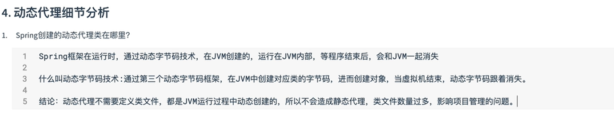
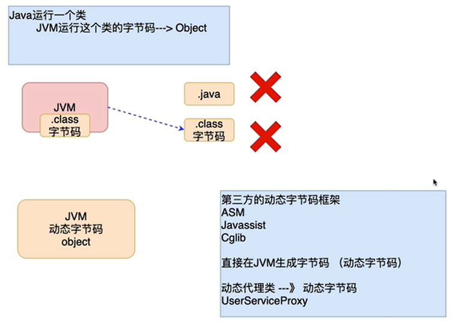
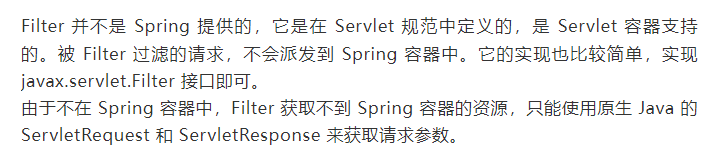

# 随手笔记

# START


- 动态代理
  - `Proxy.newProxyInstance()`

```java
/*
     public static Object newProxyInstance(ClassLoader loader,
                                  Class<?>[] interfaces,
                                  InvocationHandler h)方法
      参数1:委托对象的类加载器
      参数2:委托对象实现的接口的Class数组
      参数3:InvocationHandler接口的实现类对象
    前2个参数是为了帮助在jvm内部生成委托者的代理对象,第3个参数,用来监听代理对象调用方法,帮助我们调用方法
*/
/*
	public Object invoke(Object proxy, Method method, Object[] args)
    proxy:生成的代理对象,慎用,递归
    method:代理对象调用的方法
    args:代理对调用的方法的参数
*/
```

```java
@Override
public void doFilter(ServletRequest request, ServletResponse response, FilterChain chain) throws IOException, ServletException {
	// 字符过滤：动态代理实现
    //确认需要动态代理的对象
    HttpServletRequest request1 = (HttpServletRequest) request;
    HttpServletRequest requestProxy = (HttpServletRequest)Proxy.newProxyInstance(
            request1.getClass().getClassLoader(),
            request1.getClass().getInterfaces(),
            new InvocationHandler() {
                @Override
                public Object invoke(Object proxy, Method method, Object[] args) throws Throwable {

                    Object value = method.invoke(request1, args);

                    if ("getParameter".equals(method.getName())) {
                        String paramValue = (String) value;
                        for (String word : words) {
                            if (paramValue.contains(word)){
                                paramValue = paramValue.replace(word, "***");
                            }
                        }
                        return paramValue;
                    } else {
                        return value;
                    }
                }
            }
    );
    chain.doFilter(requestProxy, response);
}
```

- 动态字节码技术





# Spring


**AOP与过滤器执行顺序**

- filter是基于servlet的，拦截器是基于Springmvc的，aop是基于Spring的，所以请求过来拦截的顺序的也显而易见了，这是我的理解，不知道对不



- AOP：Spring-boot 提供的 AOP 接口，只需要在 Controller 方法前添加切点，然后再对切点添加通知方法进行处理即可
- Interceptor：要实现一个拦截器，可以实现 Spring 的 HandlerInterceptor 接口
  - 拦截器用于在 Controller 内 Action 被执行前通过一些参数判断是否要执行此方法


**学习方法**

- 由于 Java 繁荣的生态，下面每一个模块都有大量的文章专门讲述。其实由另外一个角度着手，从实际问题出发，将这些分散的知识串联起来，各位可以作为一个综述来看。各个模块的极致详细介绍，大家可以去翻官方文档或看网络上的其他博客。


# Spring WebFlux

## 概述


## 实现

### 底层实现

- SpringMVC 方式实现，同步阻塞的方式，基于 SpringMVC+Servlet+Tomcat
- SpringWebflux 方式实现，异步非阻塞 方式，基于 SpringWebflux+Reactor+Netty

### 编程实践

> SpringWebflux 实现方式有两种：注解编程模型和函数式编程模型

#### 注解编程模型

- 与 SpringMVC 使用相似的，MVC三层架构开发

#### 函数式编程模型

1. 在使用函数式编程模型操作时候，需要自己初始化服务器

2. 基于函数式编程模型时候，有两个核心接口：
   1. RouterFunction（实现路由功能，请求转发 给对应的 handler）
   2.  HandlerFunction（处理请求生成响应的函数）。
3. 核心任务：定义两个函数式接口的实现并且启动需要的服务器。
4. SpringWebflux 请 求 和 响 应 不 再 是 ServletRequest 和 ServletResponse ，而是 ServerRequest 和 ServerResponse（能提供异步非阻塞的支持）
   


## 执行流程

### Spring WebFlux

- SpringWebflux 基于 Reactor，默认使用容器是 Netty，Netty 是高性能的 NIO 框架，异步非阻塞的框架
- SpringWebflux 核心控制器 DispatchHandler，它实现了 WebHandler 接口，WebHandler接口的Handle方法处理流程如下：
  1. 匹配请求的处理器
  2. 执行具体的业务方法
  3. 返回处理结果
- SpringWebflux 里面 
  - DispatcherHandler负责请求的处理 ； 
  - HandlerMapping请求查询到处理的方法 ；
  - HandlerAdapter真正负责请求处理 ； 
  - HandlerResultHandler响应结果处理
    


# Shell

> [Shell 教程 - 菜鸟](https://www.runoob.com/linux/linux-shell.html)

## Shell概述

### Shell

- Shell 是一个用 C 语言编写的应用程序
- 这个应用程序提供了一个界面，用户通过这个界面访问操作系统内核的服务。

### Shell脚本

- Shell 脚本（shell script），是一种为 shell 编写的脚本程序。
- shell 和 shell script 是两个不同的概念。
- 脚本实例
  - **#!** 是一个约定的标记，它告诉系统这个脚本需要什么解释器来执行，即使用哪一种 Shell。
  - echo 命令用于向窗口输出文本。

```shell
#!/bin/bash
echo "Hello World !"
```


## [ Shell 变量](https://www.runoob.com/linux/linux-shell-variable.html)

### 定义变量

- 命名只能使用英文字母，数字和下划线，首个字符不能以数字开头。

### 使用变量

- 使用一个定义过的变量，只要在变量名前面加美元符号即可
- 推荐加花括号的写法

```shell
your_name="qinjx"
echo $your_name
echo ${your_name} #推荐写法
```

### 删除变量

- unset 命令可以删除变量
- 变量被删除后不能再次使用
- unset 命令不能删除只读变量

```shell
unset variable_name
```

### 变量类型

- **1) 局部变量** 局部变量在脚本或命令中定义，仅在当前shell实例中有效，其他shell启动的程序不能访问局部变量。
- **2) 环境变量** 所有的程序，包括shell启动的程序，都能访问环境变量，有些程序需要环境变量来保证其正常运行。必要的时候shell脚本也可以定义环境变量。
- **3) shell变量** shell变量是由shell程序设置的特殊变量。shell变量中有一部分是环境变量，有一部分是局部变量，这些变量保证了shell的正常运行

### Shell字符串

> 字符串是shell编程中最常用最有用的数据类型（除了数字和字符串，也没啥其它类型好用了），字符串可以用单引号，也可以用双引号，也可以不用引号。

#### 单引号

- 单引号里的任何字符都会原样输出，单引号字符串中的变量是无效的；
- 单引号字串中不能出现单独一个的单引号（对单引号使用转义符后也不行），但可成对出现，作为字符串拼接使用。

#### 双引号

- 双引号里可以有变量
- 双引号里可以出现转义字符

```shell
your_name="runoob"
str="Hello, I know you are \"$your_name\"! \n"
echo -e $str
```

- 输出：Hello, I know you are "runoob"! 

#### 拼接字符串

- 实例

```shell
your_name="runoob"
# 使用双引号拼接
greeting="hello, "$your_name" !"
greeting_1="hello, ${your_name} !"
echo $greeting  $greeting_1
# 使用单引号拼接
greeting_2='hello, '$your_name' !'
greeting_3='hello, ${your_name} !'
echo $greeting_2  $greeting_3

:<<EOF
hello, runoob ! hello, runoob !
hello, runoob ! hello, ${your_name} !
EOF
```


### Shell数组

#### 定义数组

- 用括号来表示数组，数组元素用"空格"符号分割开。定义数组的一般形式为：

```shell
array_name=(value0 value1 value2 value3)
```

- 单独定义数组的各个分量：

```shell
array_name[0]=value0
array_name[1]=value1
array_name[n]=valuen
```

#### 读取数组

- 读取数组元素值的一般格式是：

```shell
${数组名[下标]}
valuen=${array_name[n]}
```

- 使用 **@** 符号可以获取数组中的所有元素

```shell
echo ${array_name[@]}
```

#### 获取数组长度

- 获取数组长度的方法与获取字符串长度的方法相同

```shell
# 取得数组元素的个数
length=${#array_name[@]}
# 或者
length=${#array_name[*]}
# 取得数组单个元素的长度
lengthn=${#array_name[n]}
```


### Shell注释

#### 单行注释

```shell
#--------------------------------------------
# 这是一个注释
# author：菜鸟教程
# site：www.runoob.com
# slogan：学的不仅是技术，更是梦想！
#--------------------------------------------
##### 用户配置区 开始 #####
#
# 这里可以添加脚本描述信息
#
##### 用户配置区 结束  #####
```

#### 多行注释

- EOF或者 ' 符号或者 ! 符号

```shell
:<<EOF
注释内容...
注释内容...
注释内容...
EOF

:<<'
注释内容...
注释内容...
注释内容...
'

:<<!
注释内容...
注释内容...
注释内容...
!
```


## [Shell 传递参数](https://www.runoob.com/linux/linux-shell-passing-arguments.html)


## [Shell 数组](https://www.runoob.com/linux/linux-shell-array.html)

## [Shell 运算符](https://www.runoob.com/linux/linux-shell-basic-operators.html)

[Shell echo命令](https://www.runoob.com/linux/linux-shell-echo.html)
[Shell printf命令](https://www.runoob.com/linux/linux-shell-printf.html)
[Shell test 命令](https://www.runoob.com/linux/linux-shell-test.html)
[Shell 流程控制](https://www.runoob.com/linux/linux-shell-process-control.html)
[Shell 函数](https://www.runoob.com/linux/linux-shell-func.html)
[Shell 输入/输出重定向](https://www.runoob.com/linux/linux-shell-io-redirections.html)
[Shell 文件包含](https://www.runoob.com/linux/linux-shell-include-file.html)


# OpenAPI

## 概述

- OpenApi 是一种规范，它与语言无关。用于描述 RESTful web 服务， 只要你遵照此规范，就能使用相关工具生成文档、创建模拟应用、生成代码。
- openapi-generator，就是基于 openapi 规范编写的 api 生成代码


# Log4j2

- appender：日志打印的组件
  - 组件里面定义了打印过滤的条件、打印输出方式、滚动策略、编码方式、打印格式等等。
  - 但是它仅仅是一个打印组件，如果我们不使用一个`logger`或者`root`的`appender-ref`指定某个具体的`appender`时，它就没有什么意义。
  - 因此`appender`让我们的应用知道怎么打、打印到哪里、打印成什么样；而`logger`则是告诉应用哪些可以这么打。例如某个类下的日志可以使用这个`appender`打印或者某个包下的日志可以这么打印。
- logger：**设置日志打印级别及指定appender**
  - 用来设置某一个包或者具体的某一个类的日志打印级别以及指定`appender`。

- root：根logger，也是一种logger，且只有一个level属性
  - `root`是根`logger`,所以他两是一回事；只不过`root`中不能有`name`和`additivity`属性，是有一个`level`。

- 说明：

  1. 直接接将`root`的`appender-ref`直接指定到我们的`GLMAPPER-LOGGERONE`这个appender时，控制台中将只会打印出bannar之后就啥也不打印了，所有的启动信息都会被打印在日志文件`glmapper-loggerone.log`中。

  2. 但是实际上我们不希望我的业务日志中会包括这些启动信息。所以这个时候我们就需要通过`logger`标签来搞事情了。将上面的配置文件进行简单修改：

     ```xml
     <logger name="com.glmapper.spring.boot.controller" level="${logging.level}"
             additivity="false">
         <appender-ref ref="GLMAPPER-LOGGERONE" />
     </logger>
     
     <root level="${logging.level}">
         <appender-ref ref="STDOUT"/>
     </root>
     ```

     - 让`root`指向控制台输出；`logger`负责打印包`com.glmapper.spring.boot.controller`下的日志。


# END
